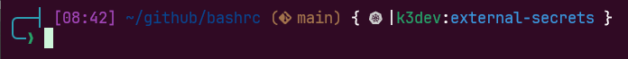
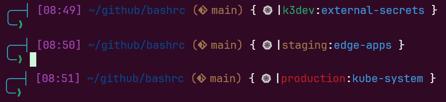

# ⚡ bashrc


Minha configuração de terminal Bash focada em **produtividade DevOps**.

Prompt de duas linhas com hora, diretório, branch do Git e contexto Kubernetes — com cores automáticas por ambiente pra não rodar comando em prod sem querer. 😅

<!--
```
╭──┤ [14:30] ~/projetos/minha-app (󰊢 main) { k8s dev-cluster:default }
╰─❯ _
```
-->




> ⚠️ O contexto K8s fica **vermelho** em produção, **verde** em dev e **amarelo** em staging.

---

## O que tem aqui

- ✅ Prompt com hora, diretório, branch Git e contexto K8s
- ✅ Cores automáticas por ambiente (segurança visual)
- ✅ Atalhos para kubectl, kubectx e kubens
- ✅ Aliases customizados para listar pods com imagens
- ✅ Plugins do Krew que uso no dia a dia

---

## Cores do contexto K8s

A cor do contexto Kubernetes no prompt muda automaticamente baseada no **nome do contexto** no seu `~/.kube/config`.



**⚠️ Importante:** Para as cores funcionarem, o nome do seu contexto no kubeconfig **precisa conter** uma dessas palavras:

| Ambiente | Cor | O nome do contexto precisa conter |
|----------|-----|-----------------------------------|
| Produção | 🔴 Vermelho | `prod` ou `prd` |
| Desenvolvimento | 🟢 Verde | `dev`, `local` ou `k3d` |
| Staging | 🟡 Amarelo | `staging`, `stg` ou `hmg` |
| Outros | 🔵 Ciano | qualquer outro nome |

Exemplo de como os contextos devem ficar no kubeconfig:

```yaml
# ~/.kube/config
contexts:
- context:
    cluster: meu-cluster-producao
    user: admin
  name: meu-app-prd          # ← contém "prd" → prompt VERMELHO
- context:
    cluster: meu-cluster-dev
    user: admin
  name: meu-app-dev           # ← contém "dev" → prompt VERDE
- context:
    cluster: meu-cluster-staging
    user: admin
  name: meu-app-hmg           # ← contém "hmg" → prompt AMARELO
```

Se o nome do seu contexto não segue esse padrão, você pode renomear:

```bash
kubectl config rename-context nome-antigo meu-app-prd
```

## Atalhos

| Alias | Comando | O que faz |
|-------|---------|-----------|
| `k` | `kubectl` | kubectl curto |
| `kx` | `kubectx` | trocar contexto |
| `kn` | `kubens` | trocar namespace |
| `kgi` | `kubectl get pods ...` | lista pods com imagem curta |
| `kgiecr` | `kubectl get pods ...` | lista pods com imagem ECR completa |

---

## Pré-requisitos

### 1. Nerd Font

Os ícones do prompt precisam de uma **Nerd Font** no seu emulador de terminal.

Eu uso a **JetBrainsMono Nerd Font**: [Baixe aqui](https://www.nerdfonts.com/font-downloads)

Após instalar, configure como fonte do seu terminal (Windows Terminal, GNOME Terminal, Alacritty, etc).

### 2. kubectl

CLI do Kubernetes.

📖 [Guia de instalação oficial](https://kubernetes.io/docs/tasks/tools/install-kubectl-linux/)

### 3. kubectx e kubens

Troca rápida de contexto e namespace.

📖 [github.com/ahmetb/kubectx](https://github.com/ahmetb/kubectx#installation)

No Ubuntu/Debian:
```bash
sudo apt install kubectx -y
```

### 4. kube-ps1

Mostra o contexto K8s no prompt do bash.

📖 [github.com/jonmosco/kube-ps1](https://github.com/jonmosco/kube-ps1)

```bash
sudo git clone https://github.com/jonmosco/kube-ps1.git /usr/local/share/kube-ps1
```

### 5. Krew (opcional)

Gerenciador de plugins do kubectl.

📖 [krew.sigs.k8s.io](https://krew.sigs.k8s.io/docs/user-guide/setup/install/)

> 💡 Se instalar os plugins `ctx` e `ns` pelo Krew, você pode usar `kubectl ctx` e `kubectl ns` no lugar do `kubectx`/`kubens` — sem precisar dos aliases `kx` e `kn` no bashrc.

---

## Plugins Krew recomendados

Após instalar o Krew, esses são os plugins que uso e recomendo:

```bash
kubectl krew install ctx ns get-all images tree node-shell pod-dive resource-capacity view-secret neat stern whoami who-can sick-pods kor df-pv ktop outdated popeye score status blame tail restart roll kurt deprecations
```

### Navegação e contexto

| Plugin | O que faz |
|--------|-----------|
| `ctx` | Trocar de contexto K8s (alternativa ao `kubectx`) |
| `ns` | Trocar de namespace (alternativa ao `kubens`) |

### Visualização e debug

| Plugin | O que faz |
|--------|-----------|
| `get-all` | Lista **todos** os recursos do cluster (não só os padrões) |
| `images` | Lista imagens em uso nos pods |
| `tree` | Mostra hierarquia de recursos (owner references) |
| `pod-dive` | Visualiza a árvore de um pod (node, containers, volumes) |
| `node-shell` | Abre um shell direto no node |
| `status` | Mostra detalhes de status de um recurso |
| `sick-pods` | Encontra pods com problemas (CrashLoop, Error, etc) |
| `stern` | Tail de logs de múltiplos pods ao mesmo tempo |
| `tail` | Stream de logs de vários pods e containers |
| `blame` | Mostra quem editou cada campo de um recurso |
| `ktop` | Top em tempo real de workloads (CPU/memória) |

### Capacidade e recursos

| Plugin | O que faz |
|--------|-----------|
| `resource-capacity` | Mostra uso de CPU/memória por node |
| `df-pv` | Uso de disco dos PVCs (tipo `df` do Linux) |
| `kor` | Encontra recursos não utilizados no cluster |
| `outdated` | Encontra imagens desatualizadas rodando no cluster |

### Segurança e RBAC

| Plugin | O que faz |
|--------|-----------|
| `view-secret` | Decodifica secrets direto no terminal |
| `whoami` | Mostra quem você está autenticado no cluster |
| `who-can` | Mostra quem tem permissão pra executar uma ação |

### Manutenção e operações

| Plugin | O que faz |
|--------|-----------|
| `restart` | Restart de deployments/statefulsets |
| `roll` | Rolling restart de recursos |
| `neat` | Limpa YAML removendo campos gerenciados pelo K8s |
| `kurt` | Mostra recursos com restart e o motivo |
| `deprecations` | Detecta recursos deprecated na versão do cluster |
| `popeye` | Scan completo do cluster por problemas e boas práticas |
| `score` | Análise estática de manifests Kubernetes |

> Todos os plugins são instalados via [Krew](https://krew.sigs.k8s.io/) — o gerenciador de plugins oficial do kubectl.

---

## Como usar

1. Instale os pré-requisitos acima

2. Faça backup do seu bashrc atual:
```bash
cp ~/.bashrc ~/.bashrc.bkp
```

3. Cole o conteúdo do arquivo [`.bashrc`](.bashrc) no final do seu `~/.bashrc`:
```bash
cat .bashrc >> ~/.bashrc
```

4. Recarregue o terminal:
```bash
source ~/.bashrc
```

Pronto! ✅

---

## Licença

[MIT](LICENSE)
